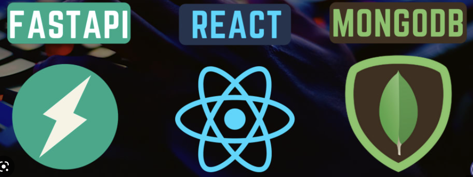

# learn_FARM_stack

Version control for keeping track of how Kaustubh is learning FARM stack being a farmer himself from Yavatmal, Maharashtra, India.

PLEASE SWITCH TO DIFFERENT BRANCHES FOR LEARNING DIFFERENT COMPONENTS OF FARM STACK

Learning to build full stack applications using FARM Stack:

Backend: FastAPI

Frontend: ReactJS

Database: MongoDB

I had NO background in Web Application Development/JS. I was good with python because of my experience in deep learning. I focused more on learning React and JSX. Now after following this routine, I am confident in navigating through the stack. There's a lot more to learn, but this learning regime will get you started faster and in the best way possible.

The flow of learning I suggest be like this:

1. ReactJS: Get deep understanding (33 Videos take 10 hrs, IT'S WORTH THE TIME)
2. FastAPI: Just take an overview ( takes 1.5 hrs)
3. FARM Stack: Learn how to integrate frontend and backend into the full-stack application. ( Piece of cake, just pay attention to routing paths)

